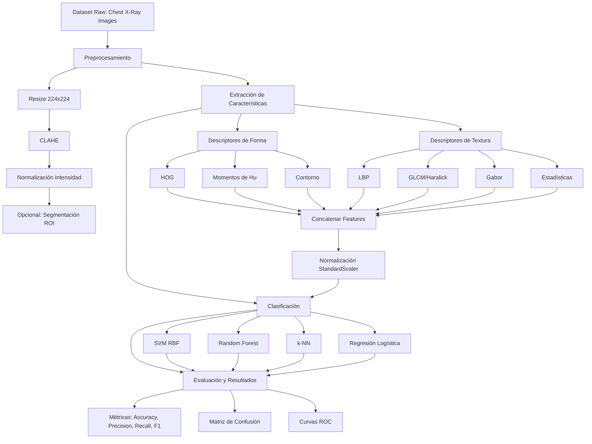
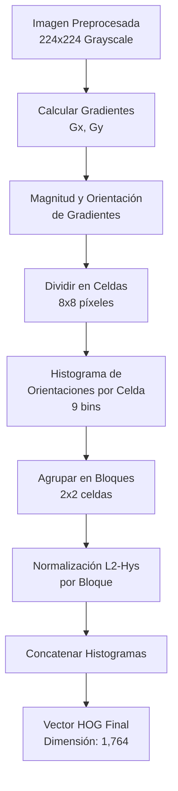
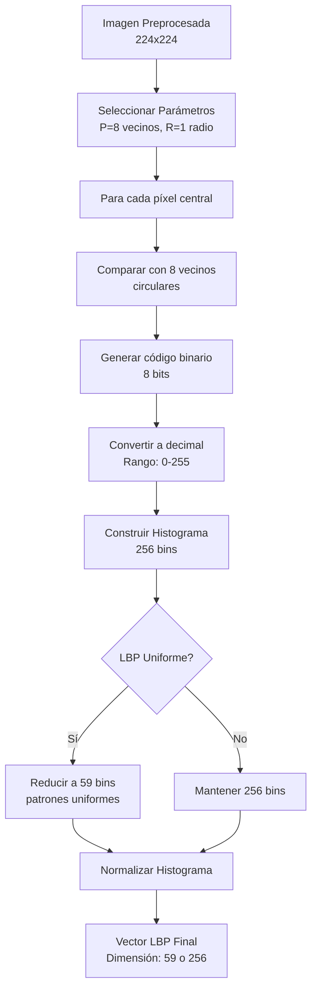
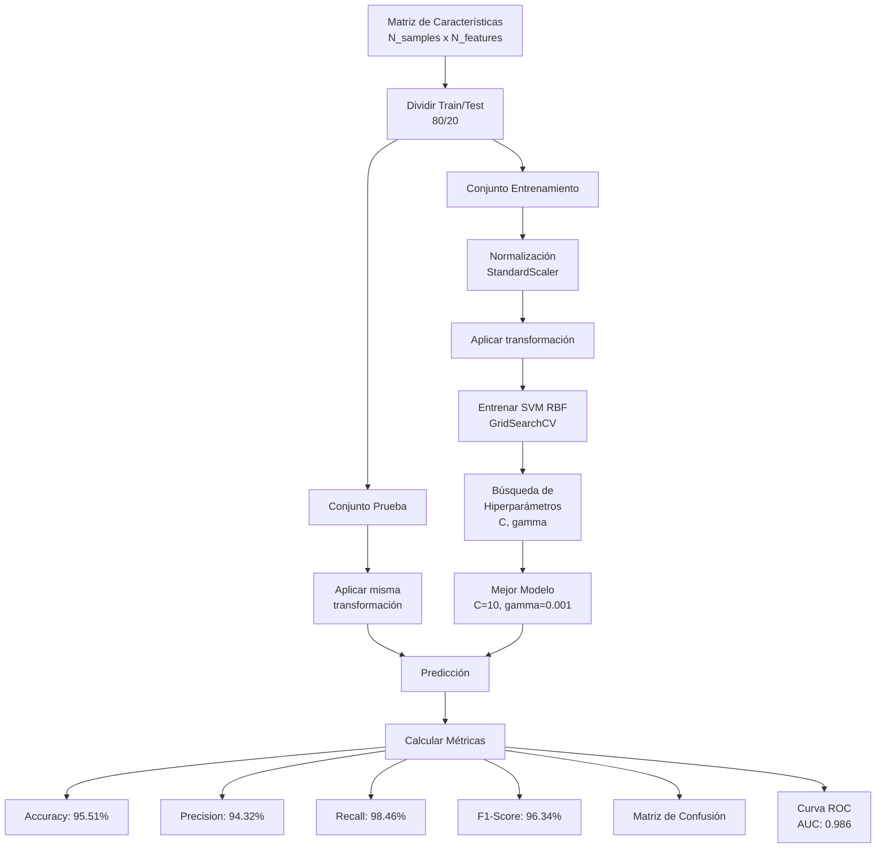
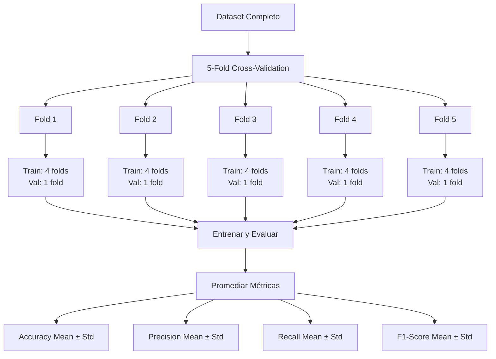
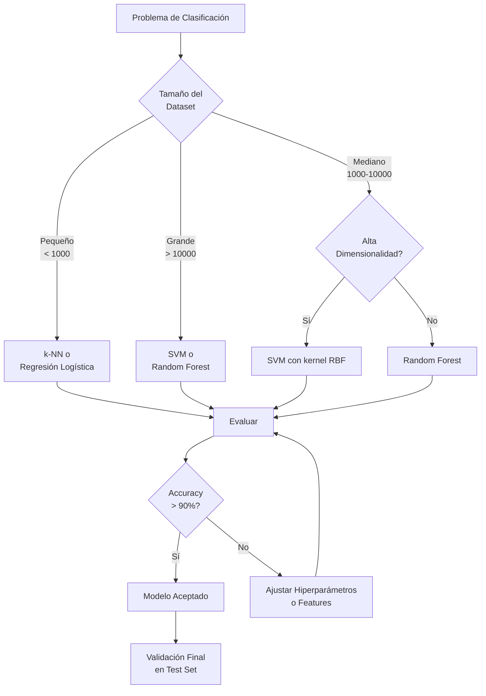
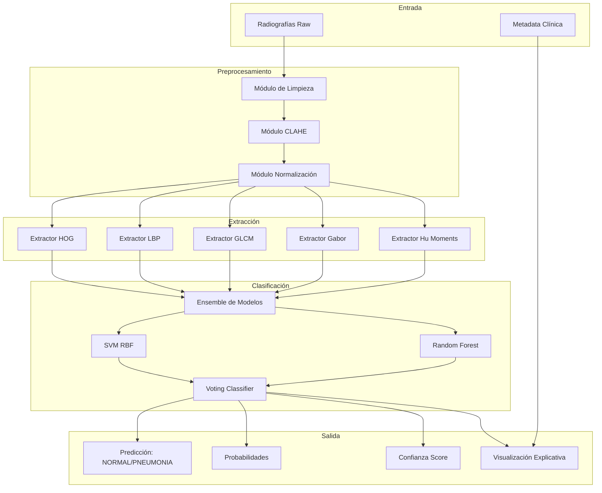

# Diagramas de Flujo del Pipeline

## Pipeline General de Clasificación de Radiografías



## Pipeline Detallado de Preprocesamiento

```mermaid
flowchart LR
    A[Imagen Original<br/>Tamaño Variable] --> B{Verificar<br/>Canales}
    B -->|RGB| C[Convertir a Grayscale]
    B -->|Grayscale| D[Resize a 224x224]
    C --> D
    
    D --> E[Aplicar CLAHE<br/>clip_limit=2.0<br/>tile_grid=(8,8)]
    
    E --> F[Normalizar<br/>Rango [0, 1]]
    
    F --> G{Segmentar<br/>ROI?}
    G -->|Sí| H[Umbralización Otsu]
    G -->|No| K[Imagen Preprocesada]
    
    H --> I[Operaciones Morfológicas<br/>Closing + Opening]
    I --> J[Máscara de Pulmones]
    J --> K
    
    K --> L[Guardar/Procesar]
```

## Pipeline de Extracción de Descriptores HOG



## Pipeline de Extracción LBP



## Pipeline de Clasificación con SVM



## Pipeline de Validación Cruzada



## Flujo de Decisión: Selección de Clasificador



## Arquitectura de Sistema Completo



---

## Notas sobre los Diagramas

Estos diagramas ilustran el flujo completo del sistema de clasificación de radiografías implementado en el proyecto. Cada diagrama representa una etapa específica o una vista diferente del pipeline:

1. **Pipeline General:** Vista de alto nivel de todo el proceso
2. **Preprocesamiento:** Detalles técnicos de la estandarización de imágenes
3. **HOG y LBP:** Algoritmos específicos de extracción de características
4. **Clasificación:** Proceso de entrenamiento y evaluación de modelos
5. **Validación Cruzada:** Estrategia de evaluación robusta
6. **Selección de Clasificador:** Lógica de decisión
7. **Arquitectura Completa:** Integración de todos los componentes

Estos diagramas pueden ser renderizados con herramientas que soporten sintaxis Mermaid (GitHub, VS Code, GitLab, etc.).
