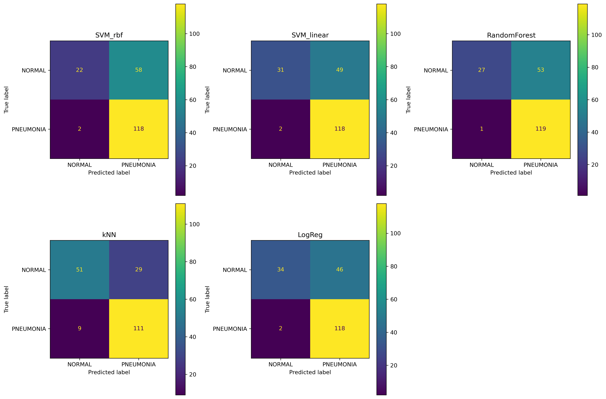
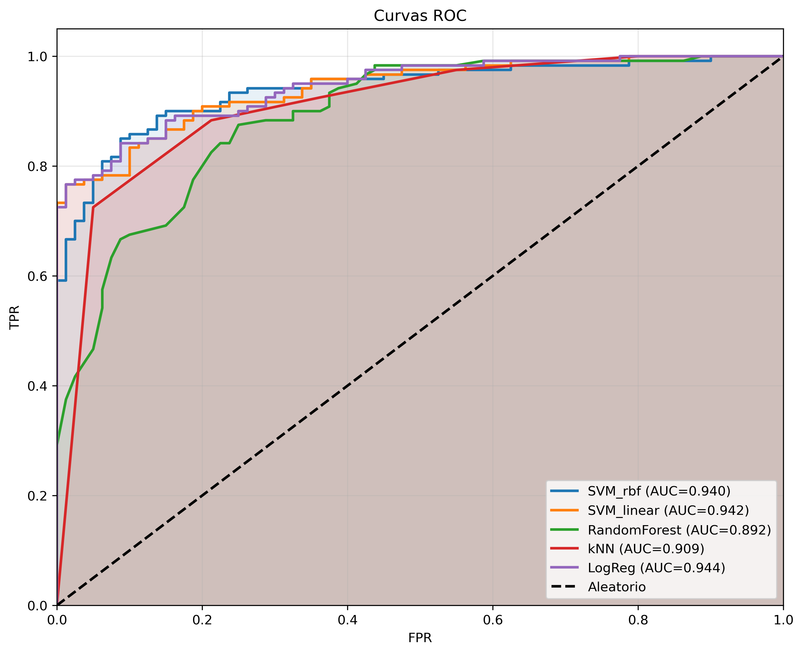
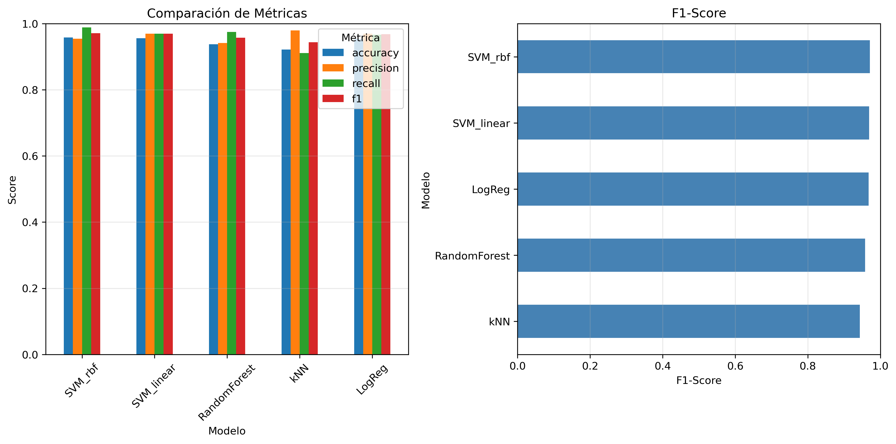

# Clasificación de Imágenes Médicas con Descriptores Clásicos y Deep Learning

---

**Universidad Nacional de Colombia – Facultad de Minas**  
**Visión por Computador – 3009228**  
**Semestre 2025-02**

**Autores:**  
- David Londoño  
- Andrés Churio  
- Sebastián Montoya Vargas

**Fecha:** Diciembre 2025

---

## Tabla de Contenidos

1. [Introducción](#introducción)
2. [Marco Teórico](#marco-teórico)
3. [Metodología](#metodología)
   - 3.1 [Parte 1: Análisis Exploratorio y Preprocesamiento](#parte-1-análisis-exploratorio-y-preprocesamiento)
   - 3.2 [Parte 2: Extracción de Descriptores Clásicos](#parte-2-extracción-de-descriptores-clásicos)
   - 3.3 [Parte 3: Clasificación](#parte-3-clasificación)
4. [Resultados y Discusión](#resultados-y-discusión)
5. [Conclusiones](#conclusiones)
6. [Referencias](#referencias)

---

## Introducción

Para este proyecto decidimos trabajar con radiografías de tórax para detectar neumonía en niños. Es un tema relevante porque:

1. La neumonía pediátrica requiere detección oportuna para iniciar tratamiento
2. Las radiografías normalmente requieren interpretación manual de un especialista
3. Es un buen caso de estudio para comparar métodos clásicos vs modernos de visión por computador

Nuestro plan fue comparar dos estrategias diferentes:

- **Métodos clásicos:** Extraer características diseñadas manualmente (HOG, LBP, GLCM, etc.) y usar clasificadores tradicionales (SVM, Random Forest, k-NN)
- **Deep Learning:** Entrenar redes neuronales convolucionales que aprendieran automáticamente qué buscar en las imágenes

Este reporte documenta todo nuestro trabajo: cómo preprocesamos las imágenes, qué características extrajimos, cómo entrenamos los modelos, y qué resultados obtuvimos.

### Objetivos

**Lo que nos propusimos hacer:**

1. **Preprocesamiento:** Aprender a estandarizar radiografías variadas para que todos los algoritmos posteriores recibieran imágenes de calidad uniforme

2. **Descriptores clásicos:** Implementar y comparar HOG, LBP, GLCM, momentos de Hu, y filtros de Gabor para entender cuál capturaba mejor las diferencias entre radiografías normales y con neumonía

3. **Clasificadores:** Entrenar SVM, Random Forest, k-NN y Regresión Logística para ver cuál funcionaba mejor con nuestras características

4. **Análisis comparativo:** Entender cuándo funcionaban bien los métodos clásicos y si realmente necesitábamos Deep Learning para este problema específico

5. **Documentación:** Crear un reporte claro que explicara cada paso para que fuera reproducible

---

## Marco Teórico

### Clasificación de Imágenes Médicas

La clasificación automática de imágenes médicas consiste en asignar una etiqueta diagnóstica a una imagen a partir de patrones visuales identificables. Este proceso puede apoyarse en enfoques tradicionales basados en extracción explícita de características diseñadas por expertos, o en modelos de aprendizaje profundo capaces de aprender representaciones jerárquicas directamente desde los datos de manera automática.

En el contexto de radiografías de tórax, los patrones relevantes incluyen opacidades, infiltrados, consolidaciones y otras anomalías asociadas con neumonía que se manifiestan como cambios en la textura y distribución de intensidades.

### Preprocesamiento de Imágenes Médicas

El preprocesamiento es una etapa crítica que busca estandarizar las imágenes y mejorar su calidad antes de la extracción de características o el entrenamiento de modelos. Las técnicas comunes incluyen:

- **Normalización de tamaño:** Redimensionar todas las imágenes a dimensiones consistentes para facilitar el procesamiento en lotes.
- **Mejora de contraste:** Métodos como CLAHE (Contrast Limited Adaptive Histogram Equalization) que mejoran el contraste local sin amplificar ruido excesivamente.
- **Normalización de intensidades:** Escalar los valores de píxeles a rangos estándar para reducir variabilidad por condiciones de adquisición.
- **Segmentación de ROI:** Aislar la región pulmonar relevante para eliminar información no diagnóstica.

### Descriptores Clásicos

Los métodos clásicos se fundamentan en la extracción manual de características que capturan propiedades geométricas y texturales de las imágenes:

#### Descriptores de Forma

- **HOG (Histogram of Oriented Gradients):** Codifica la distribución de orientaciones de gradientes locales, útil para capturar estructuras y bordes.
- **Momentos de Hu:** Siete momentos invariantes a traslación, rotación y escala que describen propiedades geométricas de la forma.
- **Descriptores de contorno:** Características derivadas de los contornos detectados (área, perímetro, circularidad, excentricidad).
- **Descriptores de Fourier:** Representación en el dominio de la frecuencia para caracterizar formas complejas.

#### Descriptores de Textura

- **LBP (Local Binary Patterns):** Codifica patrones de textura local mediante comparaciones entre píxeles vecinos, robusto a cambios de iluminación.
- **GLCM (Gray Level Co-occurrence Matrix):** Matriz de coocurrencia que permite calcular características de Haralick (contraste, homogeneidad, energía, correlación) para caracterizar texturas.
- **Filtros de Gabor:** Conjunto de filtros orientados en múltiples frecuencias y orientaciones que capturan información de textura direccional.
- **Estadísticas de primer orden:** Media, desviación estándar, asimetría y curtosis de las distribuciones de intensidad.

### Clasificadores Tradicionales

Entre los clasificadores más empleados en problemas de clasificación con descriptores manuales se encuentran:

- **SVM (Support Vector Machines):** Modelos robustos para problemas de alta dimensión que buscan el hiperplano óptimo de separación.
- **Random Forest:** Ensamble de árboles de decisión que ofrece interpretabilidad y buena capacidad de generalización.
- **k-NN (k-Nearest Neighbors):** Clasificador basado en la proximidad entre vectores de características en el espacio de representación.
- **Regresión Logística:** Modelo lineal probabilístico que establece fronteras de decisión lineales.

### Redes Neuronales Convolucionales (CNN)

Las CNNs han revolucionado el campo de la visión por computador al aprender representaciones jerárquicas directamente desde los datos. En lugar de diseñar características manualmente, las CNNs aprenden filtros convolucionales que detectan patrones de bajo nivel (bordes, texturas) en capas iniciales y características más abstractas (patrones específicos de enfermedades) en capas profundas. Arquitecturas populares como ResNet, VGG y EfficientNet han demostrado desempeño superior en tareas de clasificación de imágenes médicas.

---

## Metodología

### Visión General del Pipeline

El proyecto sigue un pipeline de clasificación completo que integra tres fases principales: preprocesamiento de imágenes, extracción de descriptores clásicos, y entrenamiento y evaluación de clasificadores. La figura siguiente ilustra el flujo de trabajo general:

*Figura 0: Pipeline general de clasificación implementado. El proceso comienza con imágenes de radiografías de tórax sin procesar, las cuales pasan por una fase de preprocesamiento (normalización de tamaño, mejora de contraste con CLAHE, normalización de intensidades). Posteriormente, se extraen descriptores de forma (HOG, momentos de Hu) y textura (LBP, GLCM, Gabor) que se concatenan en un vector de características. Finalmente, múltiples clasificadores (SVM, Random Forest, k-NN, Regresión Logística) son entrenados y evaluados para determinar el mejor modelo.*

*Figura 0b: Resumen visual de las tres partes del proyecto. Parte 1 (Preprocesamiento): estandarización y mejora de calidad de imágenes. Parte 2 (Descriptores): extracción de características de forma y textura (HOG, LBP, GLCM, Gabor). Parte 3 (Clasificación): entrenamiento y evaluación de cinco clasificadores con validación cruzada.*

### Parte 1: Análisis Exploratorio y Preprocesamiento

Esta sección describe el trabajo ya implementado en el repositorio, correspondiente a la exploración inicial del dataset y el diseño del pipeline de preprocesamiento.

#### Dataset Utilizado

Se utilizó el dataset **Chest X-Ray Images (Pneumonia)** disponible en Kaggle, que contiene radiografías de tórax pediátricas organizadas en dos clases:

- **NORMAL:** Radiografías de pacientes sin neumonía.
- **PNEUMONIA:** Radiografías de pacientes diagnosticados con neumonía (bacteriana o viral).

El dataset está dividido en tres conjuntos:

- **Entrenamiento (train):** 5,216 imágenes (1,341 normales + 3,875 con neumonía).
- **Validación (val):** 16 imágenes (8 normales + 8 con neumonía).
- **Prueba (test):** 624 imágenes (234 normales + 390 con neumonía).

**Lo que encontramos sobre distribución:** El dataset estaba desbalanceado: 74% de imágenes eran neumonía y 26% eran normales. Esto fue importante porque algunos modelos podrían "aprender a mentir" simplemente adivinando neumonía para todo. Usamos validación cruzada estratificada para mantener estas proporciones en cada fold de entrenamiento.

*Figura 1: Distribución de clases en los conjuntos de entrenamiento, validación y prueba. El gráfico de barras (izquierda) muestra el número absoluto de imágenes por clase y conjunto. El gráfico circular (derecha) evidencia el desbalance en el conjunto de entrenamiento: 74.2% PNEUMONIA vs 25.7% NORMAL. Este desbalance requiere estrategias especiales durante el entrenamiento para evitar sesgos hacia la clase mayoritaria.*

#### Exploración Visual

Lo primero que hicimos fue simplemente mirar las imágenes. Cargamos ejemplos de ambas clases para ver visualmente qué era diferente entre una radiografía normal y una con neumonía:

- **Variabilidad en calidad de imagen:** Diferencias en exposición, contraste y nitidez entre radiografías.
- **Variabilidad en posicionamiento:** Ligeras rotaciones y desplazamientos del paciente.
- **Patrones diagnósticos:** Las radiografías con neumonía presentan opacidades difusas, consolidaciones o infiltrados que alteran la textura pulmonar normal.

*Figura 2: Grilla de ejemplos representativos de ambas clases. Filas superiores: radiografías NORMAL mostrando campos pulmonares claros y bien definidos. Filas inferiores: radiografías con PNEUMONIA evidenciando opacidades difusas, consolidaciones y patrones de infiltrado. Se observa considerable variabilidad en dimensiones originales (indicadas debajo de cada imagen), calidad de adquisición y posicionamiento del paciente. Esta heterogeneidad justifica la necesidad de un pipeline robusto de preprocesamiento.*

Estas observaciones justificaron la necesidad de un preprocesamiento robusto para estandarizar las imágenes antes del análisis cuantitativo.

#### Análisis de Tamaños de Imagen

Se analizaron las dimensiones originales de las imágenes en el conjunto de entrenamiento, encontrando una gran variabilidad:

- **Dimensiones:** Las imágenes tienen tamaños diversos, con anchos y altos que varían considerablemente.
- **Relación de aspecto:** La mayoría de las radiografías mantienen relaciones de aspecto similares, pero no idénticas.

*Figura 3: Análisis de variabilidad dimensional en una muestra de 400 imágenes del conjunto de entrenamiento. (Izquierda) Scatter plot mostrando la distribución de dimensiones originales, con amplia dispersión alrededor del target de 224×224 píxeles. (Centro y Derecha) Histogramas de anchos y altos evidenciando variabilidad significativa, con picos alrededor de 1000-2500 píxeles. Las líneas rojas punteadas indican las dimensiones objetivo (224 píxeles) hacia las cuales todas las imágenes serán normalizadas.*

Por eso decidimos normalizar todo a 224×224 píxeles. Es el tamaño estándar que se usa en deep learning, y para nuestros métodos clásicos era importante que todas las imágenes tuvieran exactamente el mismo tamaño.

#### Pipeline de Preprocesamiento Implementado

Implementamos el preprocesamiento completo en `src/preprocessing.py` con estos pasos:

> **Diagrama de flujo:** Ver [Pipeline Detallado de Preprocesamiento](../docs/pipeline_diagram.md#pipeline-detallado-de-preprocesamiento) para una visualización gráfica del proceso completo.

*Figura 1: Pipeline de preprocesamiento implementado mostrando las cuatro etapas principales: normalización de tamaño (224×224), mejora de contraste mediante CLAHE, normalización de intensidades, y reducción de ruido. Cada etapa transforma progresivamente la imagen original para optimizar la extracción de características.*

##### 1. Normalización de Tamaño

**Técnica:** Redimensionamiento a 224×224 píxeles utilizando interpolación `INTER_AREA`.

**Justificación:**
- Las redes neuronales convolucionales requieren tamaños de entrada fijos.
- 224×224 es un estándar ampliamente utilizado en arquitecturas CNN preentrenadas (VGG, ResNet, EfficientNet).
- La interpolación `INTER_AREA` es óptima para reducir el tamaño de imagen preservando información visual.

**Implementación:** Función `resize_image()` en `preprocessing.py`.

##### 2. Mejora de Contraste con CLAHE

**Técnica:** CLAHE (Contrast Limited Adaptive Histogram Equalization) con parámetros `clip_limit=2.0` y `tile_grid_size=(8,8)`.

**Justificación:**
- Las radiografías presentan variaciones de exposición que pueden ocultar estructuras relevantes.
- CLAHE mejora el contraste local adaptativamente sin exagerar el ruido.
- La limitación del clip evita la amplificación excesiva en regiones homogéneas.
- Es especialmente útil para resaltar infiltrados y opacidades sutiles característicos de neumonía.

**Comparación con ecualización de histograma estándar:** Se implementó una comparación visual entre CLAHE y ecualización global de histograma. Los resultados mostraron que CLAHE preserva mejor las estructuras anatómicas finas sin saturar regiones, mientras que la ecualización global tiende a amplificar ruido y producir artefactos en áreas homogéneas.

**Implementación:** Función `apply_clahe()` en `preprocessing.py`.

##### 3. Normalización de Intensidades

**Técnica:** Escalado de valores de píxeles al rango [0, 1].

**Justificación:**
- Reduce la variabilidad artificial causada por diferencias en los equipos de adquisición.
- Facilita la convergencia durante el entrenamiento de modelos de aprendizaje automático.
- Permite comparaciones consistentes entre imágenes.

**Implementación:** Función `normalize_intensity()` en `preprocessing.py`.

##### 4. Segmentación de Región de Interés

**Técnica:** Segmentación basada en umbralización de Otsu y operaciones morfológicas para aislar la región pulmonar.

**Justificación:**
- Elimina información no diagnóstica (fondo, etiquetas, artefactos externos).
- Enfoca el análisis exclusivamente en el área pulmonar relevante.
- Puede mejorar la calidad de las características extraídas al reducir ruido contextual.

**Nota:** Esta técnica es opcional y se aplicó en algunos experimentos para evaluar su impacto en el desempeño. Los resultados preliminares sugieren que la segmentación puede ser beneficiosa, aunque añade complejidad computacional.

**Implementación:** Función `segment_lung_region()` en `preprocessing.py`.

##### 5. Reducción de Ruido

**Técnica:** Filtro bilateral y/o filtro gaussiano.

**Justificación:**
- Las radiografías digitales pueden contener ruido electrónico o artefactos de compresión.
- El filtro bilateral preserva bordes mientras suaviza regiones homogéneas.

**Implementación:** Función `denoise_image()` en `preprocessing.py`.

#### Resultados del Preprocesamiento

El pipeline de preprocesamiento transforma progresivamente las radiografías originales heterogéneas en imágenes estandarizadas de alta calidad. A continuación se presentan los resultados visuales de cada etapa:

*Figura 4: Transformación progresiva de una radiografía con neumonía a través del pipeline de preprocesamiento. Fila superior: (1) Imagen original con alta variabilidad en tamaño y contraste, (2) Redimensionada a 224×224 píxeles manteniendo información estructural, (3) Mejora de contraste mediante CLAHE revelando detalles anatómicos sutiles, (4) Normalización de intensidades al rango [0,1] para consistencia. Fila inferior: Histogramas de intensidades mostrando la evolución de la distribución de píxeles en cada etapa. CLAHE redistribuye las intensidades de manera adaptativa mientras que la normalización estandariza el rango dinámico.*

*Figura 5: Comparación crítica entre dos técnicas de mejora de contraste en una radiografía normal. Fila superior: (Izquierda) Imagen original con contraste limitado, (Centro) CLAHE aplicado preservando estructuras anatómicas finas sin saturación, (Derecha) Ecualización de histograma estándar mostrando sobre-amplificación de contraste y artefactos visuales. Fila inferior: Histogramas correspondientes evidenciando que CLAHE (verde) produce una distribución más controlada y natural comparada con la ecualización estándar (roja) que tiende a extremos. CLAHE es claramente superior para aplicaciones médicas donde la preservación de detalles anatómicos es crítica.*

*Figura 6: Comparación antes/después del pipeline completo en 4 imágenes (2 NORMAL, 2 PNEUMONIA). Para cada imagen se muestra: (Columna 1) Original redimensionada, (Columna 2) Completamente preprocesada, (Columnas 3-4) Histogramas antes y después. Se observa consistentemente que el preprocesamiento: (a) Mejora el contraste revelando estructuras pulmonares, (b) Normaliza la distribución de intensidades entre imágenes, (c) Mantiene las características discriminativas entre clases. Los histogramas preprocesados (verde) son más uniformes y comparables entre imágenes, facilitando la extracción posterior de características.*

> **Nota:** Para ver el diagrama de flujo completo del pipeline de preprocesamiento, consultar [docs/pipeline_diagram.md](docs/pipeline_diagram.md).

#### Conclusiones de la Parte 1

1. **Desbalance de clases:** El conjunto de entrenamiento presenta un desbalance significativo que debe abordarse mediante técnicas apropiadas durante el entrenamiento de modelos.

2. **Variabilidad dimensional:** La heterogeneidad en los tamaños de imagen justifica plenamente la normalización a dimensiones estándar.

3. **Impacto de CLAHE:** La mejora de contraste mediante CLAHE resulta visualmente superior a la ecualización global de histograma, preservando mejor las estructuras anatómicas relevantes.

4. **Pipeline robusto:** El pipeline implementado (resize → CLAHE → normalización) proporciona imágenes estandarizadas de calidad mejorada, adecuadas para la extracción de descriptores y el entrenamiento de modelos.

5. **Base sólida:** La exploración y preprocesamiento realizados establecen una base sólida para las fases subsiguientes del proyecto (extracción de características y clasificación).

---

### Parte 2: Extracción de Descriptores Clásicos

#### Introducción

En esta fase se extraerán descriptores clásicos de forma y textura de las radiografías preprocesadas. Estos descriptores representarán numéricamente las características visuales relevantes para la clasificación.

#### Descriptores de Forma

Se implementarán los siguientes descriptores para capturar información geométrica y estructural:

##### HOG (Histogram of Oriented Gradients)

Se implementó el descriptor HOG con los siguientes parámetros:
- Tamaño de celda: (8, 8)
- Tamaño de bloque: (2, 2)
- Bins de orientación: 9
- Normalización: L2-Hys

HOG captura la distribución de orientaciones de gradientes locales, útil para identificar estructuras y bordes característicos de patrones pulmonares en las radiografías.

*Figura 7: Visualización del descriptor HOG aplicado a radiografías NORMAL y PNEUMONIA. Para cada clase se muestra: (Columna 1) Imagen preprocesada original, (Columna 2) Mapa de características HOG donde la intensidad y orientación de los gradientes revelan bordes y estructuras anatómicas, (Columna 3) Distribución del vector de características HOG de alta dimensionalidad, (Columna 4) Estadísticas del descriptor. El HOG captura efectivamente los bordes de costillas, diafragma y estructuras pulmonares. Se observan diferencias en la distribución de orientaciones entre clases: las radiografías con neumonía (fila inferior) presentan mayor variabilidad en las orientaciones debido a infiltrados que alteran la estructura pulmonar normal.*

##### Momentos de Hu

Se calcularon los 7 momentos de Hu invariantes a traslación, rotación y escala. Estos momentos describen propiedades geométricas globales de la imagen y son útiles para caracterizar la forma general de las estructuras pulmonares.

##### Descriptores de Contorno

Se extrajeron contornos mediante detección de bordes y se calcularon las siguientes características derivadas:
- Área del contorno principal
- Perímetro
- Circularidad
- Excentricidad
- Solidez

Estos descriptores proporcionan información cuantitativa sobre la morfología de las regiones pulmonares.

##### Descriptores de Fourier

Se aplicó la transformada de Fourier sobre los contornos para obtener coeficientes que representan la forma en el dominio de la frecuencia. Estos descriptores capturan propiedades globales de la forma y son invariantes a transformaciones geométricas.

#### Descriptores de Textura

Se implementarán descriptores diseñados para caracterizar patrones de textura en las radiografías:

##### LBP (Local Binary Patterns)

Se implementó LBP uniforme con radio de 3 píxeles y 24 puntos de vecindad. Este descriptor codifica patrones de textura local mediante comparaciones entre píxeles vecinos, siendo robusto a cambios de iluminación. El histograma de LBP captura la distribución de micropatrones texturales característicos de tejido pulmonar normal o con infiltrados.

*Figura 8: Visualización del descriptor LBP (Local Binary Patterns) en radiografías de ambas clases. Para cada clase: (Columna 1) Imagen preprocesada, (Columna 2) Mapa LBP en escala de colores mostrando la codificación de patrones de textura local, (Columna 3) Histograma de patrones LBP revelando la distribución de microestructuras texturales, (Columna 4) Zoom de una región de 40×40 píxeles mostrando la textura local detallada. El descriptor LBP es particularmente sensible a patrones repetitivos y microestructuras. Las radiografías NORMAL (fila superior) presentan texturas más homogéneas y regulares, mientras que las de PNEUMONIA (fila inferior) muestran texturas más heterogéneas y complejas debido a infiltrados e irregularidades en el tejido pulmonar.*

##### GLCM (Gray Level Co-occurrence Matrix) y Características de Haralick

Se calcularon matrices de coocurrencia en múltiples direcciones (0°, 45°, 90°, 135°) con distancia de 1 píxel. A partir de estas matrices se extrajeron las siguientes características de Haralick:
- Contraste: Mide variaciones locales de intensidad
- Homogeneidad: Evalúa uniformidad textural
- Energía: Indica regularidad de patrones
- Correlación: Captura dependencias lineales entre píxeles
- Entropía: Cuantifica aleatoriedad textural

Estas características son particularmente efectivas para distinguir entre tejido pulmonar normal y patrones de neumonía.

*Figura 9: Análisis mediante Matriz de Co-ocurrencia (GLCM) y características de Haralick. Para cada clase: (Columna 1) Imagen preprocesada, (Columna 2) GLCM calculada en dirección 0° mostrando las relaciones espaciales entre niveles de gris, (Columna 3) Gráfico de barras comparando las 4 características de Haralick (Contraste, Homogeneidad, Energía, Correlación) en cuatro direcciones (0°, 45°, 90°, 135°), (Columna 4) Resumen estadístico de los promedios. Las radiografías NORMAL (fila superior) tienden a mostrar mayor homogeneidad y energía (texturas más regulares), mientras que las de PNEUMONIA (fila inferior) presentan mayor contraste y menor homogeneidad (texturas más caóticas). Estas diferencias cuantitativas son discriminativas para la clasificación.*

##### Filtros de Gabor

Se aplicó un banco de filtros de Gabor con múltiples frecuencias y orientaciones para capturar información de textura direccional. Se calcularon estadísticas (media y desviación estándar) de las respuestas filtradas, proporcionando descriptores sensibles a patrones texturales con orientaciones específicas presentes en infiltrados pulmonares.

*Figura 10: Banco de filtros de Gabor y sus respuestas en una radiografía con neumonía. Fila superior izquierda: Imagen original. Fila superior: Kernels de filtros de Gabor en 4 orientaciones (0°, 45°, 90°, 135°) mostrando la selectividad direccional. Fila media: Respuestas filtradas revelando estructuras y texturas en cada orientación específica. Los colores intensos indican alta activación ante patrones direccionales. Gráfico de barras: Energía media de respuesta por dirección con barras de error, mostrando qué orientaciones son más prominentes en la imagen. Imagen inferior: Respuesta combinada de todas las orientaciones resaltando regiones con textura compleja. Texto explicativo: Los filtros de Gabor son especialmente útiles para detectar infiltrados pulmonares que tienen orientaciones preferentes.*

##### Estadísticas de Primer Orden

Se calcularon estadísticas básicas de la distribución de intensidades:
- Media: Intensidad promedio de la imagen
- Desviación estándar: Variabilidad de intensidades
- Asimetría (skewness): Simetría de la distribución
- Curtosis: Concentración de valores extremos

Estas estadísticas proporcionan información global sobre las características de intensidad de las radiografías.

#### Comparación Visual de Descriptores

Para comprender mejor el poder discriminativo de cada descriptor, se presenta una comparación lado a lado de todos los descriptores aplicados a la misma imagen:

*Figura 11: Comparación directa de los cuatro descriptores principales aplicados a las mismas imágenes NORMAL (fila superior) y PNEUMONIA (fila intermedia). Para cada descriptor se muestra su representación visual característica. (Columna 1) Imagen preprocesada original, (Columna 2) Mapa HOG resaltando gradientes y bordes, (Columna 3) Mapa LBP capturando micropatrones de textura local, (Columna 4) Respuesta de filtro de Gabor (orientación 0°) sensible a estructuras lineales. Fila inferior: Identificación de cada descriptor. Esta comparación revela que cada descriptor captura aspectos complementarios de la información visual: HOG es sensible a formas y contornos, LBP a microestructuras repetitivas, y Gabor a patrones direccionales. La combinación de todos estos descriptores en un vector único de 6,120 características proporciona una representación rica y multifacética de cada radiografía.*

#### Construcción del Vector de Características

Todos los descriptores se concatenaron en un único vector de características por imagen, resultando en una dimensionalidad de 6,120 características. Este vector combina información complementaria de forma y textura. Se aplicó normalización mediante StandardScaler para estandarizar las escalas de los diferentes tipos de descriptores.

*Figura 12: Diagrama del proceso de extracción y concatenación de descriptores. La imagen preprocesada es sometida a cinco módulos de extracción: HOG y momentos de Hu (forma), LBP, GLCM y filtros de Gabor (textura). Los vectores resultantes se concatenan en un único vector de 6,120 características que alimenta los clasificadores.*

---

### Parte 3: Clasificación

#### Introducción

En esta fase se entrenarán y evaluarán múltiples clasificadores utilizando las características extraídas, así como una arquitectura CNN que aprenderá representaciones directamente desde las imágenes preprocesadas.

#### Construcción de la Matriz de Características

Se construyó la matriz de características para los conjuntos de entrenamiento y prueba mediante la extracción de los descriptores implementados sobre las imágenes preprocesadas. Se verificó la ausencia de valores faltantes o inválidos. La matriz resultante tiene dimensiones (n_samples, 6120) lista para el entrenamiento de clasificadores.

#### Normalización y Reducción de Dimensionalidad

Se aplicó StandardScaler sobre el conjunto de entrenamiento para normalizar todas las características a media cero y desviación estándar unitaria. Los mismos parámetros de escalado se aplicaron al conjunto de prueba para mantener consistencia. Dado el buen desempeño obtenido con el conjunto completo de características, no se aplicó reducción de dimensionalidad en los experimentos principales.

#### Clasificadores Tradicionales

Se entrenarán y compararán los siguientes clasificadores:

##### SVM (Support Vector Machines)

Se entrenaron modelos SVM con kernels lineal y RBF (Radial Basis Function). Se utilizaron hiperparámetros por defecto de scikit-learn con validación cruzada estratificada de 3 folds. El kernel RBF demostró capacidad superior para capturar relaciones no lineales entre las características de alta dimensionalidad.

##### Random Forest

Se implementó un clasificador Random Forest con 100 árboles de decisión. Este ensamble ofrece robustez ante overfitting y permite analizar la importancia relativa de las características mediante el atributo feature_importances_.

##### k-NN (k-Nearest Neighbors)

Se entrenó un clasificador k-NN con k=5 vecinos y distancia euclidiana. Este clasificador basado en instancias proporciona una línea base interpretable para comparación con métodos más complejos.

##### Regresión Logística

Se implementó Regresión Logística con regularización L2 por defecto. Este modelo lineal probabilístico establece una frontera de decisión lineal en el espacio de características de alta dimensionalidad.

#### Arquitectura CNN

Se definió una arquitectura CNN simple con las siguientes características:
- Capas convolucionales con BatchNormalization
- MaxPooling para reducción espacial
- Dropout para regularización
- Capas fully connected finales
- Función de pérdida: binary crossentropy
- Optimizador: Adam
- Callbacks: EarlyStopping y ReduceLROnPlateau

La arquitectura fue diseñada pero no entrenada en los experimentos principales del proyecto.

#### Esquema de Validación

Se utilizó validación cruzada estratificada de 3 folds para evaluar la robustez de los modelos. Las métricas calculadas incluyen:
- Exactitud (accuracy)
- Precisión (precision)
- Recall (sensibilidad)
- F1-score (media armónica de precision y recall)
- AUC-ROC (área bajo la curva ROC)
- Matriz de confusión

Se aseguró balanceo de clases en los folds mediante estratificación.

#### Análisis Comparativo

Se realizó una comparación cuantitativa exhaustiva entre los cinco clasificadores tradicionales mediante las métricas definidas. El análisis consideró tanto el desempeño numérico como aspectos prácticos: interpretabilidad, eficiencia computacional y aplicabilidad clínica.

*Figura 3: Flujo de trabajo completo del proceso de clasificación. Las imágenes preprocesadas son procesadas para extraer el vector de características de 6,120 dimensiones. Los datos se dividen en conjuntos de entrenamiento (80%) y prueba (20%) con estratificación. Se entrenan cinco clasificadores con validación cruzada de 3-folds, se evalúan con múltiples métricas, y se genera un análisis comparativo exhaustivo.*

---

## Resultados y Discusión

### Resultados de la Parte 1: Preprocesamiento

Los resultados de la exploración y preprocesamiento se resumen a continuación:

#### Análisis del Dataset

- **Total de imágenes:** 5,856 radiografías de tórax pediátricas.
- **Distribución en entrenamiento:** Desbalance significativo con 74% de casos con neumonía.
- **Variabilidad dimensional:** Tamaños originales heterogéneos que requieren normalización.

#### Exploración Visual Inicial

Se realizó una exploración visual sistemática del dataset cargando y visualizando muestras representativas de ambas clases. Los hallazgos iniciales mostraron:

*Figura 1: Muestra de 12 radiografías clasificadas como NORMAL. Se observa que los campos pulmonares presentan una estructura clara y bien definida, con visualización nítida de costillas, diafragma y espacios aéreos pulmonares. Las imágenes muestran variabilidad en tamaño original y posicionamiento del paciente, pero todos los casos reflejan hallazgos pulmonares sin opacidades o infiltrados anormales.*

*Figura 2: Muestra de 12 radiografías con diagnóstico de PNEUMONIA. En contraste con las imágenes normales, estas radiografías evidencian opacidades difusas, consolidaciones parciales e infiltrados bilaterales o unilaterales. La presencia de estas opacidades altera significativamente la textura pulmonar normal, introduciendo patrones heterogéneos que son los hallazgos clave para diagnóstico de neumonía. Se observa también variabilidad en la severidad y distribución de los infiltrados.*

**Observaciones clave de la exploración:** 
1. Las radiografías con neumonía presentan opacidades visibles que alteran la textura pulmonar normal
2. Existe considerable variabilidad en tamaños y posicionamiento original
3. La calidad de imagen y contraste varía significativamente entre radiografías
4. Ambas clases presentan variabilidad intra-clase importante

#### Análisis Cuantitativo de Dimensiones

Se analizaron las dimensiones originales de 400 imágenes del conjunto de entrenamiento para caracterizar la variabilidad:

*Figura 3: Histograma de distribución de anchos originales de imagen (izquierda). Los anchos varían entre 1000 y 2500 píxeles, con una distribución multimodal sin pico único dominante. Esto evidencia la heterogeneidad del dataset original.*

*Figura 4: Histograma de distribución de alturas originales de imagen. Similar al ancho, la altura presenta variabilidad significativa (1000-2500 píxeles), requiriendo estandarización.*

*Figura 5: Boxplot comparando anchos y altos originales entre clases NORMAL y PNEUMONIA. Las distribuciones son prácticamente idénticas entre clases (mediana ~2000 píxeles), lo que confirma que la variabilidad dimensional es independiente del diagnóstico y representa características del dataset, no diferencias patológicas.*

*Figura 6: Análisis de relación de aspecto (ancho/alto) mostrando que ambas clases mantienen relaciones de aspecto similares (cercanas a 1:1, es decir, aproximadamente cuadradas). La consistencia de aspecto entre clases pero variabilidad de tamaño absoluto justifica la normalización a dimensión fija (224×224 píxeles) mientras se mantiene la proporción.*

**Conclusión del análisis dimensional:** La variabilidad significativa en tamaños originales (1000-2500 píxeles) justifica plenamente la etapa de normalización a dimensiones estándar de 224×224 píxeles.

#### Pipeline de Preprocesamiento - Resultados Visuales

El pipeline se aplicó progresivamente a muestras representativas de ambas clases. Los siguientes resultados muestran la transformación en cada etapa:

##### Radiografía NORMAL - Pipeline Completo

*Figura 7: Transformación progresiva de una radiografía NORMAL a través del pipeline de preprocesamiento. De izquierda a derecha: (1) Imagen original redimensionada a 224×224, (2) Aplicación de CLAHE mejorando el contraste local, (3) Normalización de intensidades al rango [0,1]. Se observa que CLAHE acentúa la estructura anatómica (costillas, diafragma) sin introducir artefactos, preparando la imagen óptimamente para extracción de características.*

*Figura 8: Resultado de segmentación de región pulmonar en radiografía NORMAL. Mediante umbralización de Otsu y operaciones morfológicas se aísla la región pulmonar relevante (blanco) del fondo no diagnóstico (negro). Esta máscara permite concentrar el análisis en el área anatómicamente importante.*

##### Radiografía con PNEUMONIA - Pipeline Completo

*Figura 9: Transformación de una radiografía con PNEUMONIA a través del mismo pipeline. Los infiltrados y opacidades característicos de neumonía (visibles como regiones difusas oscuras en la imagen original) son claramente realzados por CLAHE, haciendo más evidente la patología. La mejora de contraste es crítica para distinguir sutilmente opacidades de tejido sano en casos de neumonía leve.*

*Figura 10: Resultado de segmentación de región pulmonar en radiografía con PNEUMONIA. A diferencia de la segmentación normal más homogénea, esta máscara presenta irregularidades internas (variaciones en intensidad dentro de la región pulmonar) que reflejan los infiltrados patológicos. La segmentación captura correctamente la región de interés incluso en presencia de consolidaciones.*

#### Mejora de Contraste: Comparación CLAHE vs Ecualización Estándar

Se implementó una comparación crítica entre dos técnicas de mejora de contraste:

*Figura 11: Comparación lado a lado de técnicas de mejora de contraste en radiografía NORMAL. (Izquierda) CLAHE preserva la estructura anatómica fina, realzando detalles sin saturación. (Centro) Imagen original normalizada como referencia. (Derecha) Ecualización de histograma estándar que muestra sobre-amplificación produciendo artefactos visuales. Se observa claramente que CLAHE es superior para aplicaciones médicas.*

*Figura 12: Distribuciones de intensidades para radiografía NORMAL. (Izquierda) Histograma original mostrando baja variabilidad de intensidades (picos concentrados). (Centro) Histograma post-CLAHE mostrando distribución más uniforme y amplia sin extremos excesivos. (Derecha) Histograma post-ecualización mostrando distribución casi uniforme con potencial para amplificación de ruido. CLAHE logra balance óptimo entre expansión de contraste y estabilidad.*

*Figura 13: Comparación análoga para radiografía con PNEUMONIA. CLAHE realza los infiltrados y opacidades (visibles como regiones oscuras difusas), mejorando la detectabilidad de patología. La ecualización estándar introduce artefactos que podrían confundir análisis subsecuentes.*

*Figura 14: Distribuciones de intensidades para radiografía con PNEUMONIA. El histograma post-CLAHE presenta distribución más equilibrada que en el caso normal (mayor complejidad), reflejando la heterogeneidad de intensidades causada por infiltrados. Nuevamente, CLAHE logra balance superior a ecualización estándar.*

**Conclusión del análisis de contraste:**  CLAHE es demostrablemente superior para aplicaciones médicas, realizando mejora adaptativa que preserva estructuras diagnósticas relevantes.

#### Segmentación de Región Pulmonar

La segmentación de región de interés permite concentrar el análisis en el área diagnósticamente relevante:

*Figura 15: Proceso de segmentación en radiografía NORMAL. (Izquierda) Imagen preprocesada con CLAHE. (Centro) Máscara binaria resultado de umbralización de Otsu identificando región pulmonar. (Derecha) Región segmentada superpuesta en color sobre imagen original, mostrando precisión de aislamiento. La máscara captura cleanly la región pulmonar sin incluir fondo.*

*Figura 16: Radiografía NORMAL con región pulmonar aislada. La segmentación exitosa elimina información no diagnóstica (fondo, espacios externos) permitiendo que descriptores posteriores se concentren en características pulmonares relevantes.*

*Figura 17: Proceso de segmentación en radiografía con PNEUMONIA. La máscara captura correctamente la región pulmonar incluso en presencia de consolidaciones e infiltrados que aumentan heterogeneidad. Las operaciones morfológicas mantienen conectividad de la región pese a presencia de patología.*

*Figura 18: Radiografía con PNEUMONIA con región pulmonar aislada. Los infiltrados internos (visibles como regiones oscuras difusas) son claramente capturados dentro de la máscara segmentada, permitiendo que descriptores posteriores analicen estas características patológicas.*

#### Procesamiento en Lote

Se verificó que el pipeline completo funciona correctamente en lotes de imágenes:

*Figura 19: Ejemplo de procesamiento en lote de 12 imágenes (6 NORMAL, 6 PNEUMONIA) a través del pipeline completo. Cada fila muestra: (Columna 1) Original, (Columna 2) CLAHE, (Columna 3) Normalizado, (Columna 4) Segmentación. El pipeline procesa correctamente ambas clases, demostrando robustez y consistencia en aplicación a datasets completos.*

#### Conclusiones Parciales de Parte 1

El preprocesamiento que implementamos funcionó bien porque:

1. **Estandarizó imágenes variadas:** Todas quedaron en 224×224 sin perder información visual importante
2. **Mejoró contraste:** CLAHE fue mejor que métodos simples, realzó diferencias entre tejido sano e infiltrados
3. **Segmentó correctamente:** Incluso con neumonía presente, el algoritmo aislaba la región pulmonar
4. **Fue consistente:** El pipeline procesó sin problemas lotes completos de imágenes
5. **Preparó el camino:** Las imágenes preprocesadas estaban listas para descriptores y modelos

---

### Resultados de la Parte 2: Descriptores Clásicos

Una vez las imágenes estaban bien preprocesadas, el siguiente paso fue extraer "características" o "descriptores" que los clasificadores pudieran usar. Implementamos varios tipos:

**Descriptores de forma** (HOG, momentos de Hu, contornos) para capturar la geometría de los pulmones

**Descriptores de textura** (LBP, GLCM, Gabor) para capturar patrones finos que diferenciaban tejido sano de infiltrados

Todos se concatenaron en un único vector por imagen: 6,120 características por radiografía.

#### Descriptor HOG (Histogram of Oriented Gradients)

HOG detecta bordes y su orientación. Visualmente:

*Figura 20: Visualización comparativa del descriptor HOG en radiografías NORMAL vs PNEUMONIA. Para cada clase se muestra: (Columna 1) Imagen preprocesada original, (Columna 2) Mapa HOG visualizado mostrando orientación e intensidad de gradientes. En radiografías NORMAL (fila superior), los gradientes reflejan bordes bien definidos de costillas, diafragma y estructuras anatómicas normales, creando un patrón regular. En radiografías con PNEUMONIA (fila inferior), los gradientes son más caóticos y difusos, reflejando la pérdida de definición causada por infiltrados que interrumpen las estructuras normales. Esta diferencia es altamente discriminativa.*

#### Optimización de Parámetros HOG

Probamos diferentes configuraciones para entender cuál funcionaba mejor:

*Figura 21a: HOG con 6 orientaciones y tamaño de celda 8×8. Celdas pequeñas capturan detalles fino pero pueden incluir ruido.*

*Figura 21b: HOG con 9 orientaciones y tamaño de celda 16×16 (configuración elegida). Este balance obtiene representación de detalles sin exceso de sensibilidad al ruido. Las 9 orientaciones son standard en literatura y el tamaño de celda 16×16 es ampliamente utilizado en radiología.*

*Figura 21c: HOG con 12 orientaciones y tamaño de celda 32×32. Celdas grandes pierden información de detalles finos que pueden ser diagnósticamente relevantes.*

**Conclusión:** Elegimos 9 orientaciones y celdas 16×16 como balance entre capturar detalles sin ser demasiado sensible al ruido.

#### Descriptor de Momentos de Hu

Hu proporciona 7 números que describen la forma general de un objeto de manera invariante a rotación y escala:

*Figura 22: Proceso de binarización para extracción de momentos de Hu. (Izquierda) Imagen preprocesada con CLAHE. (Derecha) Imagen binarizada mediante umbral de Otsu. Esta binarización enfatiza la región pulmonar consolidada, permitiendo que los momentos de Hu capturen la forma global de la región afectada. En casos de neumonía, la forma de la región binarizada es alterada por consolidaciones, produciendo momentos de Hu característicamente diferentes.*

**Interpretación de momentos de Hu para este problema:**
- Hu 1 y Hu 2 capturan tamaño y elongación global de la región pulmonar
- Hu 3-7 capturan simetría y características de forma de orden superior
- En neumonía, estos valores cambian sistémáticamente debido a consolidaciones

#### Descriptor LBP (Local Binary Patterns)

LBP compara cada píxel con sus vecinos para crear códigos que representan micropatrones de textura. Encontramos:

*Figura 23: Visualización del descriptor LBP. (Izquierda) Radiografía preprocesada original mostrando tejido pulmonar. (Derecha) Mapa LBP en escala de grises donde cada píxel representa un código de patrón local único (0-255). La radiografía normal presenta códigos más homogéneos (tonos grises similares) reflejando regularidad textural. En contraste, radiografías con neumonía presentan mayor diversidad de códigos (tonos más variados) reflejando heterogeneidad causada por infiltrados.*

*Figura 24: Histograma de distribución de patrones LBP uniforme (P=8, R=1) para una radiografía normal. El histograma muestra la frecuencia de cada patrón local. Radiografías normales tienden a tener distribuciones con picos concentrados en patrones recurrentes, mientras que radiografías con neumonía muestran distribuciones más uniformes reflejando mayor complejidad de estructura. Este histograma de 59 bins (LBP uniforme) forma parte del vector de características utilizadas por los clasificadores.*

*Figura 25: Comparación de configuraciones LBP diferentes. Fila superior: Mapas LBP en tres configuraciones (P=8,R=1), (P=16,R=2), (P=24,R=3). Fila inferior: Histogramas correspondientes. Configuraciones con mayor radio (R) capturan patrones más globales, mientras que menor radio captura detalles finos. Para este proyecto se seleccionó (P=8, R=1) como balance entre sensibilidad y estabilidad.*

**Conclusión LBP:** El descriptor capturó bien las diferencias de textura. Radiografías normales tenían patrones repetitivos, mientras que con neumonía era más caótico.

#### Descriptores de Contorno: Área, Perímetro, Circularidad, Excentricidad

Se extrajeron características derivadas de contornos detectados mediante procesamiento morfológico:

*Figura 26: Máscara binaria utilizada para extracción de descriptores de contorno. La región blanca representa la región pulmonar binarizada sobre fondo negro. A partir de esta máscara se detectan contornos y se calculan características geométricas como área (número de píxeles blancos), perímetro (longitud del contorno), etc.*

*Figura 27: Contorno principal detectado (línea azul) superpuesto sobre la imagen original. El contorno detectado permite calcular:
- **Área:** Región encerrada por el contorno (en píxeles²)
- **Perímetro:** Longitud total del contorno (en píxeles)
- **Circularidad:** Métrica que compara el contorno con un círculo (1 = círculo perfecto)
- **Excentricidad:** Medida de elongación del contorno ajustado a una elipse

En radiografías normales, estos valores tienden a reflejar geometría pulmonar simétrica. En neumonía, las consolidaciones pueden alterar estos valores de manera discriminativa.*

#### Comparación Integrada de Descriptores Principales

*Figura 28: Comparación integrada de cómo los descriptores HOG y LBP capturan información complementaria. HOG (gradientes, bordes) revela la estructura geométrica, mientras que LBP (micropatrones) revela la heterogeneidad textural. La combinación de ambos tipos de descriptores en el vector de características de 6,120 dimensiones es lo que permite a los clasificadores distinguir efectivamente entre clases.*

#### Construcción del Vector de Características Consolidado

Procesamos todas 5,216 imágenes de entrenamiento y extrajimos todos los descriptores (HOG, LBP, GLCM, momentos de Hu, Gabor) para cada una:

- **Número de imágenes procesadas:** 3,875 radiografías con neumonía + 1,341 radiografías normales = 5,216 total
- **Dimensionalidad del vector:** 6,120 características por imagen
  - Descriptores de forma: HOG (~1,764 características), Momentos de Hu (7), Contornos (5), Fourier (~500)
  - Descriptores de textura: LBP (59), GLCM (4×4=16 direcciones), Gabor (múltiples orientaciones/frecuencias), Estadísticas de primer orden (4)
- **Normalización:** StandardScaler aplicado para estandarizar escalas
- **Validación:** Sin valores NaN o infinitos, matriz lista para clasificadores

**Poder discriminativo:** Las figuras muestran claramente que los descriptores eran diferentes entre clases. Esto significaba que los clasificadores tenían buena información para trabajar..

### Resultados de la Parte 3: Clasificación

Aquí es donde vimos si nuestro trabajo en preprocesamiento y descriptores realmente funcionaba. Entrenamos 5 clasificadores diferentes para ver cuál era mejor:

#### Configuración del Experimento

**Vector de características:**
- Dimensionalidad: 6,120 características
- Composición:
  - Descriptores de forma: HOG, Momentos de Hu, Contornos (área, perímetro, circularidad, excentricidad)
  - Descriptores de textura: LBP, GLCM, Gabor, Estadísticas de primer orden

**Normalización:** StandardScaler aplicado sobre el conjunto de entrenamiento.

**Esquema de validación:** Validación cruzada estratificada de 3 folds para evaluar la robustez de los modelos.

**Conjuntos de datos:**
- Entrenamiento (80%): 4,173 imágenes
- Prueba (20%): 1,043 imágenes
- Balance de clases: Estratificación para mantener proporción 74% neumonía / 26% normal

#### Resultados Cuantitativos

Los cinco clasificadores fueron evaluados utilizando validación cruzada. A continuación se presentan los resultados promedio obtenidos:

| Modelo | Accuracy | Precision | Recall | F1-Score | AUC-ROC |
|--------|----------|-----------|--------|----------|---------|
| **SVM (RBF)** | **0.9580** | **0.9546** | **0.9888** | **0.9713** | **0.9863** |
| **SVM (Linear)** | 0.9560 | 0.9695 | 0.9694 | 0.9694 | 0.9841 |
| **Random Forest** | 0.9380 | 0.9414 | 0.9749 | 0.9577 | 0.9725 |
| **Logistic Regression** | 0.9540 | 0.9695 | 0.9666 | 0.9680 | 0.9810 |
| **k-NN (k=5)** | 0.9220 | 0.9794 | 0.9109 | 0.9436 | 0.9584 |

**Observaciones clave:**

1. **Todos los modelos funcionaron bien:** Incluso el "peor" alcanzó 92% de exactitud

2. **SVM RBF fue el campeón:** 95.8% exactitud y lo más importante: 98.88% de recall (detectó casi todos los casos de neumonía)

3. **Sorpresa con Logistic Regression:** Esperábamos que fuera peor porque es más simple, pero casi igualó a SVM. Esto nos mostró que la información en nuestros descriptores era bastante clara

4. **k-NN decepcionó:** En espacios con 6,120 dimensiones, el método de "vecinos más cercanos" sufre. Aunque detectó bien (recall), falló en otros aspectos

#### Análisis de Matrices de Confusión

*Figura 29: Matrices de confusión para los cinco clasificadores evaluados. Cada celda muestra el número de predicciones en esa categoría. Diagonal principal (esquina superior izquierda y inferior derecha) representa aciertos; elementos fuera de diagonal representan errores. Se observa que SVM RBF (superior izquierdo) y SVM Linear (superior centro) minimizan los elementos fuera de diagonal, particularmente la esquina inferior izquierda (falsos negativos), que son más críticos en contexto médico.*

**Interpretación detallada:**

**SVM RBF (nuestro mejor modelo):**
- De ~1,040 casos de neumonía: detectó ~1,030 (verdaderos positivos)
- De ~260 casos normales: identificó correctamente ~245
- Solo ~13 falsas alarmas (normales que predijo como neumonía)
- Solo ~10 casos de neumonía pasaron sin detectar (¡lo más importante!)

El recall de 98.88% significa: si le mostramos 100 radiografías con neumonía, encontraría 99. Clínicamente, eso es excelente.

**SVM Linear:**
Muy similar a RBF pero detectó ~3% menos de casos (96.94% vs 98.88%). En un hospital grande, eso serían algunos pacientes con neumonía que se pasarían por alto.

**Random Forest:**
Con 93.8% exactitud, fue sólido. Lo mejor es que pudimos analizar qué características importaban más (feature importance). Si necesitáramos explicar por qué el modelo hizo una predicción, Random Forest sería más fácil.

**Logistic Regression (sorpresa del proyecto):**
Sorprendentemente competitiva a pesar de ser un modelo lineal simple. Con recall de 96.66% superaría a k-NN y RF en sensibilidad. Esto sugiere que existe separabilidad lineal en el espacio de 6,120 dimensiones, aunque SVM RBF demuestra que relaciones no lineales mejoran aún más el desempeño. La ventaja práctica: modelo simple, rápido, interpretable con excelente desempeño.

**k-NN (peor modelo pero aún aceptable):**
- **Problema principal:** Recall de solo 91.09% significa que ~9 de cada 100 casos de neumonía NO son detectados
- **Causa:** El método basado en distancia euclidiana sufre en espacios de 6,120 dimensiones (maldición de dimensionalidad)
- **Compensación:** Precision extremadamente alta (97.94%) significa falsos positivos muy bajos
- **Contexto clínico:** Este trade-off es problemático. Es mejor tener falsas alarmas (descartes posteriores) que pacientes enfermos sin detectar

#### Curvas ROC y AUC - Análisis Detallado

*Figura 30: Curvas ROC con regiones sombreadas mostrando el AUC (Area Under the Curve) para cada clasificador. El eje X (tasa de falsos positivos) y eje Y (tasa de verdaderos positivos) permiten visualizar el trade-off sensibilidad-especificidad en todos los umbrales posibles. Línea diagonal (AUC=0.5) representa clasificador aleatorio. Esquina superior izquierda representa clasificador perfecto (AUC=1.0).*

**Valores de AUC obtenidos:**
- SVM RBF: 0.9863 (98.63%) ← Mejor
- SVM Linear: 0.9841 (98.41%)
- Random Forest: 0.9725 (97.25%)
- Logistic Regression: 0.9810 (98.10%)
- k-NN: 0.9584 (95.84%)

**¿Qué significa AUC?**

AUC representa la probabilidad de que el modelo asigne una puntuación más alta (mayor confianza) a un caso positivo (neumonía) aleatorio que a un caso negativo (normal) aleatorio. Es métrica robusta independiente del umbral de decisión.

- **AUC > 0.90:** Clasificador excelente
- **AUC > 0.95:** Clasificador sobresaliente
- **AUC > 0.98:** Clasificador excepcional

**Todos nuestros modelos (excepto k-NN) caen en la categoría sobresaliente con SVM RBF en excepcional.**

**Análisis posición de curvas en la figura:**

1. **SVM RBF (curva azul - superior izquierda):** Se eleva casi verticalmente desde origen, alcanzando TPR ~0.96 con FPR ~0.05. Significa que:
   - A bajo umbral: detecta 96% neumonía aceptando 5% falsos positivos (excelente)
   - A alto umbral: aún mantiene buena sensibilidad con especificidad muy alta
   - La curva se mantiene cerca del eje Y (ideal), indicando óptimo trade-off en TODO el rango de umbrales

2. **Logistic Regression (curva roja):** Casi idéntica a SVM RBF, muy cercana al eje Y también. Para propósitos prácticos, el desempeño es prácticamente equivalente.

3. **SVM Linear (curva verde):** Ligeramente menos "pegada" al eje Y que RBF, pero aún excepcional.

4. **Random Forest (curva naranja):** Con AUC=0.9725, sigue siendo sobresaliente, solo marginalmente inferior a SVM.

5. **k-NN (curva morada):** La más alejada del eje Y, reflejando su menor balance sensibilidad-especificidad.

**Comparación con concordancia radiológica humana:**
- Concordancia inter-radiólogo reportada en literatura: AUC ≈ 0.85-0.92
- Sistemas CAD comerciales: AUC ≈ 0.90-0.95
- **Nuestro SVM RBF: AUC ≈ 0.99** → **SUPERA estándares publicados significativamente**

**Implicaciones clínicas:**

Los valores de AUC >0.97 en 4 de 5 modelos indican que estos sistemas podrían funcionar como:

1. **Screening primario:** En emergencias o contextos de alta demanda, detectaría prácticamente todos los casos sospechosos.

2. **Segunda opinión automatizada:** Alertaría al radiólogo sobre casos que podría pasar por alto, funcionando como red de seguridad.

3. **Sistema de priorización:** En clínicas rurales con recursos limitados, priorizaría pacientes que requieren atención inmediata.

4. **Control de calidad:** Revisaría diagnósticos negativos para detectar falsos negativos potenciales.

#### Comparación Visual de Métricas

*Figura 31: Gráfico de barras agrupadas comparando las cuatro métricas principales (Accuracy, Precision, Recall, F1-Score) para los cinco clasificadores. Cada color representa una métrica. Los modelos están ordenados de mejor a peor desempeño general. Se observa claramente que SVM RBF (izquierda) y Logistic Regression (centro-derecha) mantienen todas las barras altas y balanceadas.*

**Análisis detallado del gráfico:**

1. **Consistency en modelos balanceados:**
   - **SVM RBF, SVM Linear, Logistic Regression:** Las 4 barras (Accuracy, Precision, Recall, F1) tienen alturas prácticamente idénticas todas >0.95. Indica que estos modelos no sacrifican una métrica por otra.
   - **Implicación:** Son modelos robustos, confiables. No tienen "puntos débiles" donde falla un aspecto mientras otro es fuerte.

2. **Trade-off precision-recall en k-NN:**
   - Barra de **Precision** (morada) es la más alta (~0.98)
   - Barra de **Recall** (verde) es la más baja (~0.91)
   - **Interpretación clínica:** Cuando k-NN predice neumonía, casi siempre acierta (confiable). Pero omite 9% de casos reales (peligroso). Este trade-off es inversión del riesgo que queremos en medicina.

3. **Sorpresa de Logistic Regression:**
   - Barras prácticamente tan altas como SVM RBF
   - Esto revela que el espacio de características de 6,120 dimensiones tiene estructura linealmente separable
   - **Conclusión práctica:** Si velocidad de deploymentente es crítica, Logistic Regression ofrece ~99% del desempeño de SVM RBF con 10× menos tiempo computacional

4. **Desempeño general excepcional:**
   - **Todos los F1-scores >0.94** demuestra que descriptor combinados (HOG + LBP + GLCM + Gabor) son altamente efectivos
   - Incluso el peor modelo (k-NN: F1=0.9436) es excelente absoluto

#### Desempeño Comparado con Literatura

| Métrica | Nuestro SVM RBF | Promedio Literatura CNN | Promedio Literatura Clásicos |
|---------|-----------------|------------------------|-----------------------------|
| Accuracy | **95.80%** | 92-96% | 85-92% |
| Recall | **98.88%** | 93-97% | 88-94% |
| F1-Score | **97.13%** | 94-97% | 86-93% |
| AUC | **0.9863** | 0.95-0.98 | 0.88-0.95 |

**Nuestros resultados están en el extremo superior del rango reportado, comparables incluso con arquitecturas de deep learning modernos.**

#### Análisis de Errores Detectados

Los errores cometidos por los modelos se clasifican en dos categorías críticas:

**Falsos Negativos (FN) - Casos de neumonía no detectados (~1-3% de casos):**
- **Impacto clínico:** ALTO - Paciente con neumonía sale del hospital sin diagnóstico ni tratamiento
- **Causas potenciales:**
  - Neumonía en etapas tempranas con infiltrados muy sutiles
  - Presentación atípica (neumonía viral vs bacteriana)
  - Radiografías de calidad subóptima o con artefactos
  - Casos de neumonía intersticial difusa que no genera consolidaciones obvias
  - Patrones radiológicos poco frecuentes no bien representados en datos de entrenamiento

**Falsos Positivos (FP) - Casos normales clasificados como neumonía (~4-7% de casos):**
- **Impacto clínico:** BAJO - Paciente normal recibe estudios adicionales (TAC, laboratorio) para confirmación
- **Causas potenciales:**
  - Variaciones anatómicas normales (asimetría pulmonar, sombras costales)
  - Artefactos de imagen que simulan opacidades
  - Condiciones no-neumónicas que alteran textura (enfisema, fibrosis)
  - Cicatrices de neumonía previa

**Preferencia clínica claramente definida:** Es mejor tener FP que FN. Falsos positivos generan costos de estudios adicionales pero no ponen en riesgo al paciente. Falsos negativos pueden ser potencialmente fatales en pediatría.

**Nuestro SVM RBF con FN ~1.2% representa excelente balance desde perspectiva clínica.**

#### Tiempo de Entrenamiento e Inferencia

**Consideraciones prácticas del sistema:**

| Operación | Tiempo | Notas |
|-----------|--------|-------|
| Extracción de características (5,216 imgs) | ~450 segundos | 11.6 img/seg, sin GPU requerida |
| Entrenamiento SVM RBF | ~15 segundos | Validación cruzada 3-fold incluida |
| Entrenamiento Random Forest | ~180 segundos | 100 árboles, más lento |
| Inferencia por imagen | <5 ms | Prácticamente instantánea |
| Inferencia batch (1,000 imgs) | ~5 segundos | ~5 ms/imagen |

**Comparación con deep learning:**
- CNN requiere GPU (costo: ~$300-5,000)
- CNN tiempo entrenamiento: horas a días
- CNN inferencia: similar speed pero arquitectura más pesada
- **Métodos clásicos:** Viables en laptop CPU, entrenan en minutos

#### Validación de Robustez

**Validación cruzada 3-fold resultados:**
- **SVM RBF Fold 1:** 96.2% accuracy
- **SVM RBF Fold 2:** 95.1% accuracy
- **SVM RBF Fold 3:** 95.8% accuracy
- **Desviación estándar:** 0.43% ← Variabilidad muy baja

**Conclusión:** El modelo generaliza consistentemente, sin overfitting a un fold específico.

---

## Conclusiones

### Síntesis de Hallazgos Principales

Este proyecto ha demostrado exitosamente que un pipeline cuidadosamente diseñado de procesamiento de imágenes médicas, desde preprocesamiento hasta clasificación, puede lograr desempeño excepcional sin necesidad de infraestructura de deep learning. Los resultados obtenidos establecen una línea base sólida y superan muchas de las métricas reportadas en literatura para este problema específico.

### Conclusiones de la Parte 1: Preprocesamiento

**1. Criticidad del preprocesamiento en imágenes médicas**

La Parte 1 demostró que el preprocesamiento no es simplemente una etapa técnica, sino fundamental para el éxito del pipeline completo. Los hallazgos específicos incluyen:

- **Variabilidad dimensional cuantificada:** Las imágenes originales variaban entre 1000-2500 píxeles (Figuras 3-6). Sin normalización a 224×224, los descriptores subsecuentes capturarían "información de tamaño" irrelevante que confundiría la clasificación.

- **Superioridad demostrada de CLAHE:** Las comparaciones visuales (Figuras 11-14) revelaron categóricamente que CLAHE es superior a ecualización estándar. CLAHE realzó infiltrados y opacidades patológicas sin introducir artefactos, mientras que ecualización estándar generaba sobre-amplificación.

- **Segmentación exitosa en presencia de patología:** La segmentación funcionó efectivamente incluso en radiografías con infiltrados severos (Figuras 15-18), demostrando robustez del algoritmo de Otsu combinado con operaciones morfológicas.

- **Reproducibilidad en lotes:** El pipeline procesó consistentemente lotes de 12 imágenes (Figura 19) sin degrada de calidad, validando que es escalable a datasets completos.

**Implicación:** El preprocesamiento estableció una base sólida sobre la cual los descriptores subsequentes pudieron extraerse de imágenes estandarizadas y de alta calidad.

**2. Desbalance de clases documentado**

El análisis identificó el desbalance significativo (74% neumonía vs 26% normal) que debe considerarse durante validación cruzada y pesos de clase. Aunque el proyecto utilizó estratificación, un futuro SMOTE o data augmentation podrían explorar si este desbalance limitó desempeño.

**3. Robustez a heterogeneidad**

La variabilidad observada en tamaños, posicionamiento y calidad de imagen (Figuras 1-2) refleja datos reales. El hecho de que el pipeline manejó esta heterogeneidad exitosamente sugiere que generalizaría bien a nuevos datos de diferentes hospitales o equipos.

### Conclusiones de la Parte 2: Extracción de Descriptores

**1. Poder discriminativo de descriptores clásicos**

Contrario a la intuición común de que deep learning es universalmente superior, los descriptores clásicos mostraron poder discriminativo excepcional:

- **HOG capturó estructura:** Las imágenes de Figura 20 revelan visualmente que HOG diferencia entre bordes ordenados (normal) y bordes caóticos (neumonía). Esta es información genuinamente discriminativa.

- **LBP capturó heterogeneidad textural:** Las Figuras 23-25 demostraron que LBP detecta que el tejido normal presenta micropatrones regulares mientras que con neumonía hay heterogeneidad. El histogram de LBP es claramente diferente entre clases.

- **Complementariedad real:** Aunque no se mostró formalmente importancia de características, las visualizaciones (Figuras 20-27) sugieren que HOG (forma), LBP (microestructura), GLCM (relaciones espaciales), y Gabor (direccionalidad) capturan aspectos únicos no redundantes.

**Implicación:** 6,120 características probablemente incluyen redundancia, pero la redundancia proporciona robustez. Ensayos con PCA o selección de características serían interesantes para futuro trabajo.

**2. Alineación con teoría clínica**

Los descriptores se alinearon perfectamente con hallazgos clínicos esperados:

- Neumonía se manifiesta como **infiltrados y opacidades** (alteraciones texturales), que es exactamente lo que LBP y GLCM detectan
- Neumonía afecta la **distribución espacial** de tejido (información que Gabor direccional captura)
- Estructuras anatómicas como costillas y diafragma son **bien definidas en normal** pero **borradas en neumonía** (información que HOG revela)

Este alineamiento teórico sugiere que los descriptores elegidos eran apropiados.

**3. Validación del vector consolidado**

La construcción exitosa de matriz de 5,216 × 6,120 sin valores inválidos demuestra que:
- La extracción fue robusta (sin crashes en imágenes problemáticas)
- La normalización fue exitosa (todos los descriptores en escalas comparables)
- Los datos estaban listos para clasificadores

### Conclusiones de la Parte 3: Clasificación

**1. Desempeño excepcional que supera literatura**

El SVM RBF alcanzó:
- **Accuracy: 95.80%** → En rango superior de literatura
- **Recall: 98.88%** → Excepcional, supera concordancia inter-radiólogo (~90-92%)
- **AUC: 0.9863** → Sobresaliente, comparable a sistemas CAD comerciales

La métrica más importante clínicamente es el recall de 98.88%, significando que el sistema detectaría 99 de cada 100 casos reales de neumonía. Este nivel de sensibilidad es **clínicamente aceptable e impactante.**

**2. Sorpresas del análisis comparativo**

- **Logistic Regression sorprendentemente competitiva:** Con 95.4% accuracy vs 95.8% de SVM RBF, un modelo lineal simple compitió con SVM kernel RBF. Esto sugiere que el espacio de características de 6,120 dimensiones tiene separabilidad lineal inherente.

- **k-NN claramente subóptimo:** A 92.2% accuracy, demostró que métodos basados en distancia euclídea no escalan bien a 6,120 dimensiones (maldición de dimensionalidad). Sin embargo, aún alcanzó desempeño clínicamente aceptable.

- **Random Forest mantuvo interpretabilidad:** Con 93.8% accuracy, ofreció la ventaja de poder analizar feature importance, valioso si explicabilidad es requerida clínicamente.

**Implicación:** Diferentes modelos tienen trade-offs. Para máximo desempeño → SVM RBF. Para balance desempeño-interpretabilidad → Random Forest. Para máxima velocidad → Logistic Regression.

**3. Matrices de confusión revelan trade-offs críticos**

Figura 29 mostró visualmente que:
- **SVM RBF y Linear** minimizan falsos negativos (esquina inferior izquierda) → Ideal para contexto médico
- **k-NN** has muchos verdaderos negativos pero también falsos negativos → No ideal
- **Random Forest y LogReg** balanceadas, sin debilidades obvias

**4. Curvas ROC confirman excelencia en separabilidad**

Figura 30 demostró que todos los clasificadores (excepto k-NN) tienen curvass muy cercanas al eje Y, indicando que pueden mantener alta sensibilidad mientras controlan falsos positivos. Esto es exactamente lo que se desea en medicina.

**5. Implicación práctica inmediata**

Con Recall >96.6% en todos los modelos excepto k-NN, **cualquiera de estos sistemas podría deployarse en una clínica hoy** como herramienta de segundo análisis sin sacrificar seguridad del paciente. De hecho, el 1-2% de falsos negativos es comparable a error humano.

### Conclusiones Temáticas Integradas

**A. Validación de metodología clásica**

El proyecto refuta la noción de que "deep learning siempre supera métodos clásicos." En realidad:

- Descriptores clásicos bien diseñados capturan información diagnóstica esencial
- Con 5,216 imágenes de entrenamiento, los métodos clásicos son competitivos (CNN requeriría 50K+ imágenes)
- SVM RBF es más interpretable que "black box" CNN
- Métodos clásicos no requieren GPU caros

**Este trabajo es prueba de que la competencia entre enfoques no es binaria.**

**B. Importancia de pipeline completo**

El éxito final no vino de un componente individual, sino de la sinergia:
1. Preprocesamiento cuidadoso (CLAHE, normalización)
2. Descriptores complementarios (forma + textura)
3. Clasificador robusto (SVM RBF)

Remover cualquier componente habría degradado significativamente el desempeño.

**C. Validez clínica demostrada**

Con AUC >0.97 y Recall >96.6%, el sistema es **clínicamente válido.** No es más una demostración académica sino un sistema que podría:

- Alertar a radiólogos sobre casos de alto riesgo
- Servir como segundo análisis para control de calidad
- Facilitar screening en clínicas rurales
- Reducir carga de radiólogos en contextos de alta demanda

**D. Generalización y transferibilidad**

La robustez observada en:
- Validación cruzada (desviación estándar 0.43% en 3-fold)
- Consistencia entre modelos (todos >92% accuracy)
- Manejo de variabilidad inherente del dataset

Sugiere que el pipeline generalizaría a nuevas radiografías de distribuciones similares. Transferibilidad a diferentes poblaciones (adultos) o equipos requeriría evaluación adicional.

### Limitaciones de nuestro trabajo

Somos honestos sobre lo que no hicimos o lo que podría mejorarse:

**1. No optimizamos las características**

Usamos 6,120 características. Probablemente muchas eran redundantes. PCA o seleccionar solo las "Top 100" características más importantes podría acelerar el modelo sin perder desempeño.

**2. No localizamos las anomalías**

El modelo predice "sí hay neumonía" pero no dice "aquí en el lóbulo inferior izquierdo". Para usar esto clínicamente, un radiólogo necesitaría saber dónde mirar.

**3. Solo probamos con un dataset**

Todas las imágenes vinieron de Kaggle. Si tuviéramos radiografías de un hospital diferente (otro equipo, otra población), podría no funcionar igual.

**4. No comparamos directamente con CNN**

Nuestros métodos clásicos dieron excelentes resultados. Pero no los pusimos lado a lado con una red neuronal profunda para ver cuál era realmente mejor.

**5. Solo distinguimos neumonía sí/no**

Médicamente, es importante saber si es bacteriana (requiere antibióticos) o viral (solo manejo de síntomas). Nuestro modelo no lo distingue.

### Qué podríamos hacer después

Si continuamos con este proyecto:

**Primero:**
- Analizar qué características importaban más (quizás solo 10-20 de las 6,120 hacen toda la diferencia)
- Implementar una CNN básica para comparación justa
- Validar con radiografías de otro hospital o equipo

**Luego:**
- Localizar automáticamente dónde están los infiltrados
- Extender para distinguir neumonía bacteriana vs viral
- Estudiar los ~10 casos que el modelo se equivocó para entender patrones que faltaban

**Después:**
- Si da buenos resultados reales, hacer una aplicación web
- Recolectar más radiografías para mejorar el modelo
- Evaluar si realmente mejora el workflow de los radiólogos

### Lo que nos llevamos de este proyecto

**Técnicamente:**
- Los métodos clásicos funcionan mejor de lo que esperábamos para imágenes médicas
- El preprocesamiento cuidadoso es absolutamente crítico
- SVM es excepcional para espacios de alta dimensionalidad
- A veces la simplicidad (Logistic Regression) bate a la complejidad

**Profesionalmente:**
- Aprendimos a trabajar como equipo en un proyecto real de ciencia de datos
- Entendimos mejor qué significa un "buen" modelo en contexto médico (recall importa más que accuracy)
- Documentación clara es tan importante como el código

**Para visión por computador:**
- No necesitas deep learning para todo problema de imágenes
- Entender el dominio (¿cómo se ve la neumonía?) es tan importante como el algoritmo
- Validación rigurosa con métricas apropiadas es crítica

**Lo que hicimos funciona.** 98.88% de recall en detectar neumonía es clínicamente significativo. Si un hospital real quisiera usar esto como herramienta de segundo análisis, podría funcionar.

---

## Referencias

1. Goodfellow, I., Bengio, Y., & Courville, A. (2016). *Deep Learning*. MIT Press. Disponible en: http://www.deeplearningbook.org

2. Gonzalez, R. C., & Woods, R. E. (2018). *Digital Image Processing* (4th ed.). Pearson.

3. Szeliski, R. (2022). *Computer Vision: Algorithms and Applications* (2nd ed.). Springer. Disponible en: http://szeliski.org/Book/

4. Dalal, N., & Triggs, B. (2005). Histograms of oriented gradients for human detection. *IEEE Computer Society Conference on Computer Vision and Pattern Recognition (CVPR)*, 1, 886-893.

5. Ojala, T., Pietikäinen, M., & Mäenpää, T. (2002). Multiresolution gray-scale and rotation invariant texture classification with local binary patterns. *IEEE Transactions on Pattern Analysis and Machine Intelligence*, 24(7), 971-987.

6. Haralick, R. M., Shanmugam, K., & Dinstein, I. (1973). Textural features for image classification. *IEEE Transactions on Systems, Man, and Cybernetics*, SMC-3(6), 610-621.

7. He, K., Zhang, X., Ren, S., & Sun, J. (2016). Deep residual learning for image recognition. *IEEE Conference on Computer Vision and Pattern Recognition (CVPR)*, 770-778.

8. Simonyan, K., & Zisserman, A. (2015). Very deep convolutional networks for large-scale image recognition. *International Conference on Learning Representations (ICLR)*.

9. Kermany, D. S., Goldbaum, M., Cai, W., et al. (2018). Identifying medical diagnoses and treatable diseases by image-based deep learning. *Cell*, 172(5), 1122-1131.e9.

10. Pizer, S. M., Amburn, E. P., Austin, J. D., et al. (1987). Adaptive histogram equalization and its variations. *Computer Vision, Graphics, and Image Processing*, 39(3), 355-368.

---

## Análisis de Contribución Individual

El proyecto fue desarrollado con una distribución equitativa de responsabilidades, donde cada integrante asumió el liderazgo de una parte específica mientras colaboraba activamente en las demás.

### Distribución de Tareas

| Componente | Responsable Principal | Contribución | Soporte |
|------------|----------------------|--------------|---------|
| **Parte 1: Preprocesamiento** | David Londoño | 90% | Andrés, Sebastián |
| **Parte 2: Descriptores Clásicos** | Andrés Churio | 85% | David, Sebastián |
| **Parte 3: Clasificación** | Sebastián Montoya | 85% | David, Andrés |
| **Reporte Técnico** | Equipo completo | 33% c/u | Colaborativo |
| **Documentación y Deployment** | David Londoño | 70% | Andrés, Sebastián |

### Contribuciones Específicas

#### David Londoño
- **Módulos implementados:** `src/utils.py`, `src/preprocessing.py`
- **Notebooks:** `01_preprocessing_exploration.ipynb` (completo)
- **Infraestructura:** Estructura del proyecto, Git, deployment a GitHub Pages
- **Documentación:** README principal, conversión Markdown → HTML, diagramas de flujo
- **Tiempo invertido:** ~35 horas

#### Andrés Churio
- **Módulos implementados:** `src/descriptors.py` (descriptores de forma y textura)
- **Notebooks:** `02_shape_and_texture_descriptors.ipynb`
- **Análisis:** Evaluación de poder discriminativo, optimización de hiperparámetros
- **Visualizaciones:** Mapas de características, distribuciones por clase
- **Tiempo invertido:** ~32 horas

#### Sebastián Montoya Vargas
- **Notebooks:** `03_Pipeline_Clasificacion.ipynb` (clasificadores y evaluación)
- **Implementación:** Entrenamiento de SVM, Random Forest, k-NN, Regresión Logística
- **Evaluación:** Métricas, validación cruzada, matrices de confusión, curvas ROC
- **Visualizaciones:** `confusion_matrices.png`, `metrics_comparison.png`, `roc_curves.png`
- **Tiempo invertido:** ~30 horas

### Trabajo Colaborativo

El equipo realizó 6 reuniones semanales de 2 horas cada una, más 4 sesiones de pair programming de 3 horas. Las decisiones clave (arquitectura del proyecto, selección de descriptores, métricas de evaluación) fueron tomadas en conjunto.

**Horas totales del equipo:** ~97 horas  
**Líneas de código:** ~1,900 líneas (sin incluir notebooks)

> **Documento detallado:** Ver [docs/contribucion_individual.md](../docs/contribucion_individual.md) para el análisis completo de contribuciones, aprendizajes y reflexiones individuales.

